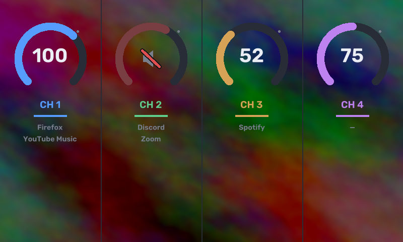

# beacn-mix-linux



Use a **Beacn Mix** as a PipeWire channel mixer on Linux: bind a running app's
audio to one of the four channels and ride its level with the matching hardware
encoder. Encoder **press** toggles mute.

## How it works

The Beacn Mix is a *vendor-specific USB control surface* (`33ae:0004`) — **not**
a sound card. It only emits encoder deltas + button presses (and drives its
screen). So the "four channels" live on the host:

- Each channel is a PipeWire **null-sink** (`BeacnCh1..4`), looped back to your
  default output so it's audible.
- Apps are routed onto a channel's sink; the encoder rides that **sink volume**,
  giving a true per-channel fader.

All USB work is handled by [`beacn-lib`](https://github.com/beacn-on-linux/beacn-lib),
which already implements the Mix control device. This tool is the host-side glue
(event → PipeWire), driving PipeWire through `pactl`.

## Usage

```sh
cargo build --release

# Sanity check: print raw encoder/button events
./target/release/beacn-mix events

# Run the mixer (creates the 4 channel sinks, then listens to the encoders)
./target/release/beacn-mix run

# In another terminal: manage routing in a TUI (assign / move / unassign)
./target/release/beacn-mix tui

# ...or bind a single playing app to a channel (1-4) one-shot
./target/release/beacn-mix assign

# Remove the channel sinks when done
./target/release/beacn-mix teardown
```

The `tui` runs alongside the `run` daemon (it never opens the device). It has two
pages (`Tab` to switch): **Routing** (which apps are on each channel; assign / move /
unassign) and **Settings** (panel dim timeout + brightness — see below).

Bindings (app → channel) persist to `~/.config/beacn-mix-linux/bindings.json`;
the `run` daemon re-routes a bound app onto its channel whenever it reappears.
Channel volumes/mutes persist to `~/.local/state/beacn-mix-linux/levels.json`
and are restored on the next `run`.

The panel shows a Beacn-style arc gauge per channel (volume integer, mute icon)
with the channel label and its grouped source apps. After an idle period it **dims**
to a low-but-visible brightness (it does not turn off); a knob turn, button press, or
a routing change in the TUI restores full brightness. Preview the layout without
hardware via `beacn-mix preview`.

### Display settings

Open `beacn-mix tui`, press `Tab` to the **Settings** page, and adjust **Dim after**
(idle minutes before dimming), **Full brightness**, and **Dim brightness** with
`←/→`. The same page has a **custom name per channel** (select the row, press `Enter`,
type, `Enter`/`Esc` when done) — the name shows on the panel and in the TUI instead of
"CH n". Changes save to `~/.config/beacn-mix-linux/display.json` and the running daemon
applies them within ~1 s.

### Custom background

Drop an image at `~/.config/beacn-mix-linux/background.{png,jpg,jpeg}` and the
gauges are drawn over it (cover-scaled to 800×480 and darkened for legibility);
remove it to go back to the solid colour. The daemon loads it once at startup —
after swapping the file, open `beacn-mix tui`, go to the **Settings** page, select
**Reload background**, and press `Enter` to have the running daemon re-read it
within ~1 s (no restart needed). Tune the darkening via `SCRIM` in `src/screen.rs`.

## Permissions

Accessing the device needs no root — a logged-in session already gets an ACL on
the USB node. To make that robust across reconnects, install the udev rule:

```sh
sudo cp 50-beacn.rules /etc/udev/rules.d/
sudo udevadm control --reload-rules && sudo udevadm trigger
```

## Run on login

`beacn-mix.service` is a systemd **user** unit (it needs your session's PipeWire
and device ACL):

```sh
install -m755 target/release/beacn-mix ~/.local/bin/beacn-mix
mkdir -p ~/.config/systemd/user && cp beacn-mix.service ~/.config/systemd/user/
systemctl --user daemon-reload && systemctl --user enable --now beacn-mix.service
```

To update later: rebuild, `install -m755 target/release/beacn-mix ~/.local/bin/`,
then `systemctl --user restart beacn-mix.service`.

## Status / next steps

Working: per-channel volume + mute from the encoders, runtime assignment + a
routing TUI, the 800×480 gauge panel with optional custom background, and
idle-resume screen wake. Not yet done (see `beacn-lib`'s `set_button_colour`):
lighting the encoder rings.

## Credits

- The UI font is [Rubik](https://github.com/googlefonts/rubik) by The Rubik
  Project Authors, bundled under the [SIL Open Font License 1.1](assets/Rubik-OFL.txt).

## License

MIT. See [LICENSE](LICENSE).
